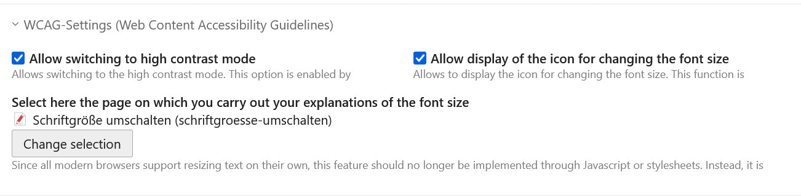
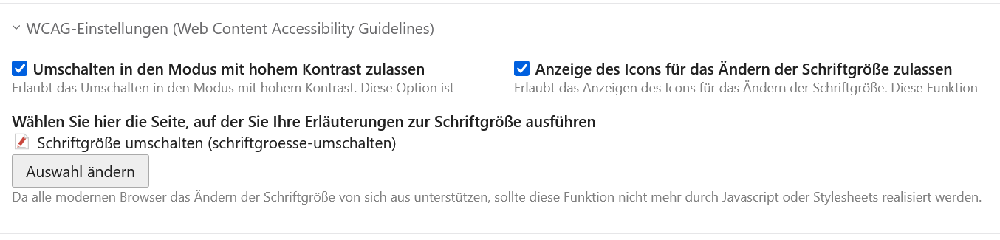

# theme-components-bundle

A collection of elements without styling for our Contao Themes.
Contained Elements:

- Contentbox
- Teaserbox
- Price Table
- Feature Element
- Slider Element
- Content Wrapper
- Contrast switcher icon
- Size icon insert tag with backlink

## Available insert tags

    {{comp::contrast}}
    {{comp::size::barrierefreiheit.html#fontSize}}

Where **_link_** can be replaced by a _**alias**_ or a _**Uri**_ in the comp::size::link insert tag.
If no **_link_** is specified, the tag generates a link to the root page.

The insert tags can be placed anywhere you like, and the appearance depends on your theme or styling.

This symbol stands for _**switch between high and low contrast**_:

and this for _**change font size**_:

But these are only two examples. The appearance depends on your theme and styling.

The SVG icons are taken from: https://github.com/google/material-design-icons (See also the enclosed license under [LICENSE_MATERIAL_DESIGN_ICONS](LICENSE_MATERIAL_DESIGN_ICONS)).

## Configuration
You have the option to configure the use of _**high contrast**_ and _**font size**_ to a small extent.
This is done in the start point of the website for the entire page tree below.  
You can find the options under ► _**pages**_ ► _**website start page**_ under the legend ► _**WCAG settings (Web Content Accessibility Guidelines)**_.
WCAG here stands for the official [Web Content Accessibility Guide](https://www.w3.org/Translations/WCAG20-de/).

Here you can de/activate features (i.e. insert tags) individually and define the assignment between the _**page explaining the
font size change**_ and the icon.

# German

Dieses Bundle bringt verschiedene Elemente mit Templates (ohne Styling) für unsere Contao Themes mit.
Enthaltene Elemente:

- Contentbox
- Teaserbox
- Preistabelle
- Feature-Element
- Slider-Element
- Inhaltscontainer
- Kontrastwechsler Icon
- Insert Tag für Schriftgröße mit Backlink-Funktion

## Verfügbare Insert-Tags
Das bundle stellt die zwei Insert-Tags bereit:

    {{comp::contrast}}
    {{comp::size::link}}

Wobei **_link_** beim Insert-Tag comp::size::link durch einen _**alias**_ oder eine _**Uri**_ ersetzt werden kann. 
Wird kein **_link_** angegeben, so generiert das Tag einen Link auf die Root-Page. Die Insert-Tags können beliebig platziert werden, wobei das Aussehen von Ihrem Theme oder Styling abhängig ist.

Dabei steht dieses Symbol für _**hohen Kontrast umschalten**_:

und dieses für _**Schriftgröße ändern**_:

Das sind aber nur zwei Beispiele. Die Darstellung ist von Ihrem Theme und vom Styling abhängig.

The SVG icons stammen aus: https://github.com/google/material-design-icons (Siehe dazu auch die beiliegende Lizenz unter [LICENSE_MATERIAL_DESIGN_ICONS](LICENSE_MATERIAL_DESIGN_ICONS)).

## Konfiguration
Sie haben die Möglichkeit, die Verwendung von _**hohem Kontrast**_ und _**Schriftgröße**_ in geringen Umfang zu konfigurieren.
Das geschieht im Startpunkt der Website für den gesamten darunter liegenden Seitenbaum.  
Sie finden die Optionen unter ► _**Seiten**_ ► _**Website-Startseite**_ unter der Legende ► _**WCAG-Einstellungen (Web Content Accessibility Guidelines)**_.
WCAG steht hier für den offiziellen [Standard zur barrierefreihen Gestaltung von Websites](https://www.w3.org/Translations/WCAG20-de/). 

Hier können Sie Features (sprich Insert-Tags) einzeln de/aktivieren und die Zuordnung zwischen der _**Seite zur Erläuterung der 
Schriftgrößenänderung**_ und dem Icon festlegen.

# DEV
## run before commit

    vendor/bin/ecs check src tests
